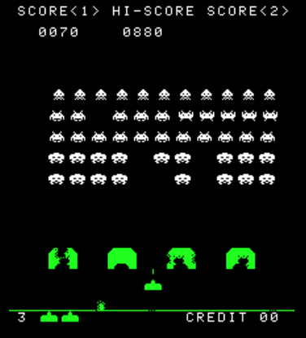

# Development

```
cd space-invaders
npm install
npm start
```

# Build

```
cd space-invaders
npm run build
cd ./dist
```

# Задание
Реализовать клон культовой игры Space Invaders.

1. Collision Detection для попаданий снарядов в пришельцев
2. Логика атаки врагов - в какой момент стреляет враг? Куда целится? Как влияет на соседей?
3. Очистка массивов объектов - если враг убит или снаряд покинул экран, его не нужно далее отслеживать
4. Доп. режимы - если игрок выполняет несколько убийств подряд или очищает линию, то враги становятся сильнее на n секунд 
	(стреляют чаще, снаряды меняют цвет и летят быстрее)
5. Обработка поведения при выходе пушки за Сanvas
6. Опционально - добавить логику разрушения бункеров.
7. Предложить алгоритм для движения пришельцев
8. Предложить альтернативные формации пришельцев
9. Опционально - Friendly Fire для пришельцев.
10. Учесть ситуацию, когда снаряд за кадр пролетит через пришельца
11. Обработать ситуации победы и поражения (сколько есть запасных пушек)
Возможный вариант реализации:



